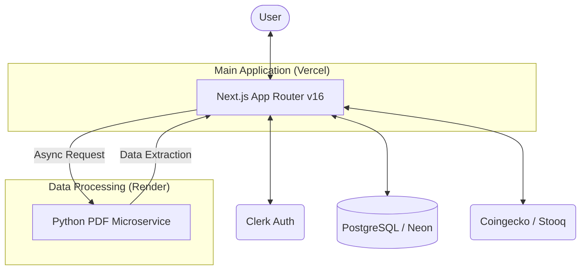

# Moneta — Smart Financial Dashboard

[](https://nextjs.org/)
[](https://prisma.io/)
[](https://clerk.com/)
[](LICENSE)

Moneta is a precision-engineered personal finance management platform built for modern life. It combines high-performance web architecture with a dedicated Python microservice to provide a seamless, secure, and data-rich experience for tracking wealth and spending.

**Live Project:** [monetafin.vercel.app](https://monetafin.vercel.app)

---

## 🏗️ Architecture Overview

The system is designed with a clear separation of concerns, utilizing a hybrid Next.js and Python architecture to handle specialized data processing tasks effectively.



## ✨ Core Features

- **Asynchronous Bank Import**: A dedicated Python/Flask service processes PDF bank statements, extracting and translating (KA ➔ EN) transactions without blocking the user interface.
- **Unified Investment Portfolio**: Real-time tracking for Stocks, Crypto, Property, and Custom assets.
- **Intelligent Financial Health**: A 4-pillar scoring system (Savings, Spending, Goals, Engagement) providing actionable insights based on demographic benchmarking.
- **Bento Grid Dashboard**: Optimized layouts for Mobile, Tablet, and Desktop, ensuring critical financial data is always at a glance.
- **Recurring Transactions Engine**: Automated bill and income tracking via Vercel Cron.

## 🛠️ Technology Stack

### Frontend & Core
- **Framework**: [Next.js 16.2.4](https://nextjs.org/) (App Router, Server Actions)
- **State Management**: custom hooks + SWR for optimized data fetching.
- **Styling**: [Tailwind CSS v4](https://tailwindcss.com/) with a custom design system and glassmorphism accents.
- **Type Safety**: End-to-end [TypeScript](https://www.typescriptlang.org/) integration.

### Backend & Infrastructure
- **Database**: [PostgreSQL](https://www.postgresql.org/) managed via [Prisma 7.7.0](https://www.prisma.io/).
- **Processing**: [Python 3.12](https://www.python.org/) + [Flask](https://flask.palletsprojects.com/) + [pdfplumber](https://github.com/jsvine/pdfplumber).
- **Authentication**: [Clerk v6](https://clerk.com/) with custom themes.

---

## 🚀 Getting Started

### Prerequisites
- Node.js 20+
- Python 3.10+
- PostgreSQL instance

### Installation

1. **Clone & Install Dependencies**
   ```bash
   git clone https://github.com/karroge10/Moneta.git
   cd Moneta
   npm run setup
   ```

2. **Database Setup**
   ```bash
   npx prisma db push
   npm run seed
   ```

3. **Development Server**
   ```bash
   npm run dev
   ```

---

## 👤 Portfolio Quality

This repository represents a high-quality, professional implementation. Key engineering decisions include:
- **Clean Architecture**: Decoupled UI components and business logic via custom hooks (`useDashboardData`, `useLandingScroll`).
- **Performance Optimized**: Fine-grained code splitting and skeleton loading states.
- **Security Focused**: No sensitive data in repository, documented environment variables, and secure authentication flows.
- **Maintainable**: Consolidated utility functions and standardized naming conventions.

---

## 📄 License
MIT License. See [LICENSE](LICENSE) for details.
