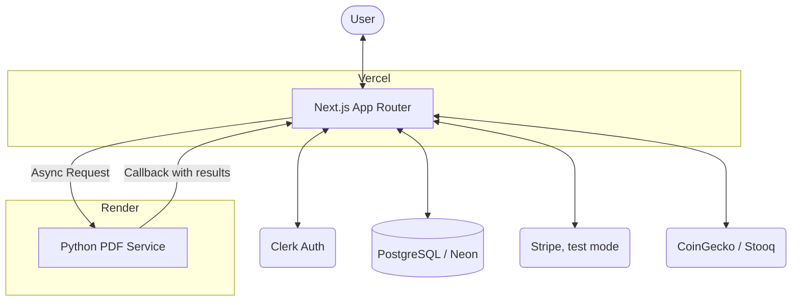

# Moneta

Personal finance dashboard: transactions, budgets, recurring items, investments and a financial
health score. Bank statements (PDF) are parsed by a separate Python service.

Live: [monetafin.vercel.app](https://monetafin.vercel.app)

## Architecture


```mermaid
graph TD
    User([User]) <--> NextApp[Next.js App Router]
    NextApp <--> Clerk(Clerk Auth)
    NextApp <--> DB[(PostgreSQL / Neon)]
    NextApp <--> Stripe(Stripe, test mode)
    NextApp <--> ExternalData(CoinGecko / Stooq)
    NextApp -- Async Request --> PythonSvc[Python PDF Service]
    PythonSvc -- Callback with results --> NextApp

    subgraph "Vercel"
        NextApp
    end

    subgraph "Render"
        PythonSvc
    end
```

- Bank import: the app sends the PDF to the Python service (Flask + pdfplumber, Georgian to
  English translation), which posts the extracted transactions back to the app.
- Recurring transactions run from a Vercel Cron job (`/api/cron/recurring`, see `vercel.json`).
- Billing: Moneta Premium via Stripe, test mode only. See [docs/STRIPE.md](docs/STRIPE.md).

## Stack

- Next.js 16.3 (App Router), React 19, TypeScript
- TanStack React Query for client data fetching
- Tailwind CSS v4
- Prisma 6.19 with PostgreSQL
- Clerk 6 for auth
- Stripe (test mode)
- Python 3.12 service in `python-service/` (deployed on Render), PDF parsing code in `python/`

## Getting started

Prerequisites: Node.js 22, a PostgreSQL database, and Python 3.10+ only if you run the PDF
service locally.

```bash
git clone https://github.com/karroge10/Moneta.git
cd Moneta
npm install
cp .env.example .env.local   # fill in the values
```

Set up the database with migrations, then seed reference data. Do not use `prisma db push`.

```bash
npm run db:deploy   # prisma migrate deploy
npm run seed
```

Optional: set up the local Python environment for PDF import (not run on install).

```bash
npm run setup
```

Start the dev server:

```bash
npm run dev
```

## Scripts

| Command | What it does |
| --- | --- |
| `npm run dev` | Dev server |
| `npm test` | Unit tests (Vitest) |
| `npm run lint` | ESLint |
| `npm run type-check` | `tsc --noEmit` |
| `npm run db:migrate` | Create and apply a migration in development |
| `npm run db:deploy` | Apply pending migrations |
| `npm run seed` | Seed categories, currencies and other reference data |
| `npm run seed:demo-user` | Fill one user with demo data |
| `npm run verify:cron` | Check the cron setup |

## Environment

All variables are listed with comments in [.env.example](.env.example).

## License

MIT. See [LICENSE](LICENSE).
